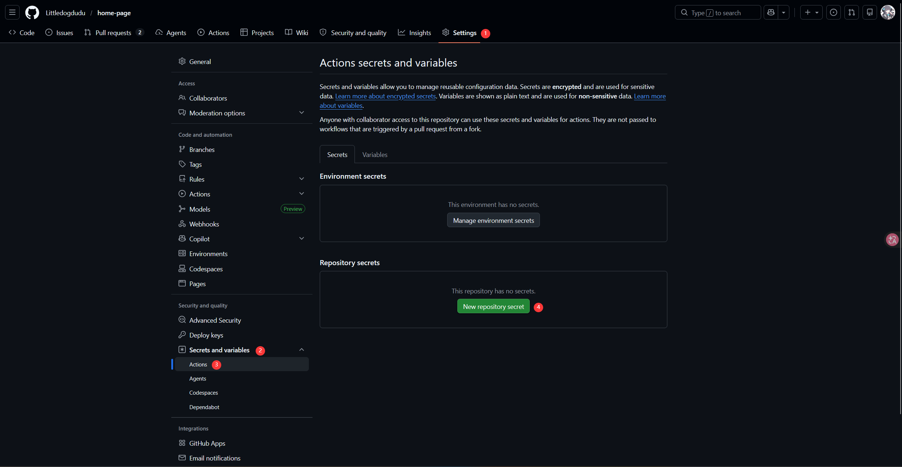
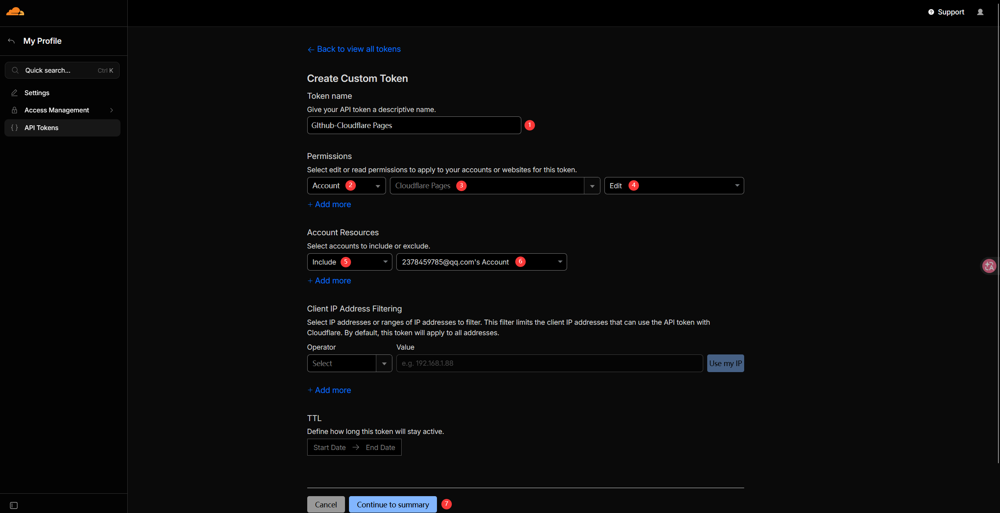
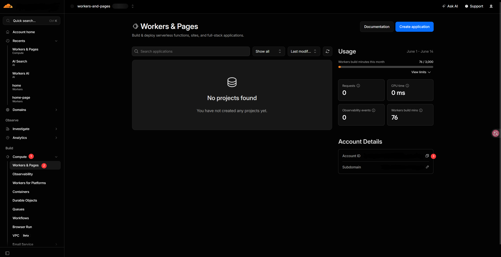
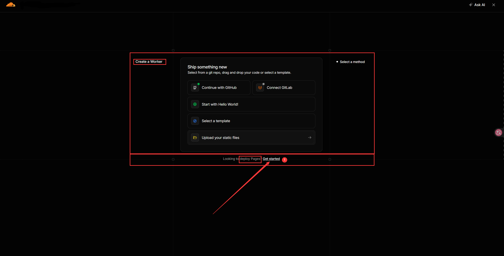
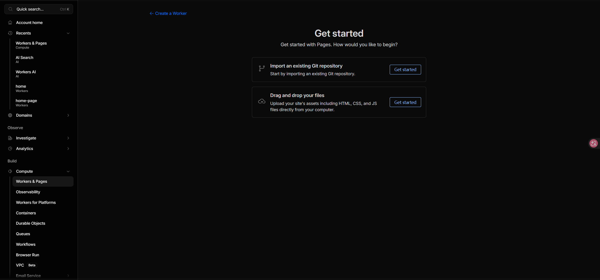

# 基于Quartz v5的个人博客网站

## Let's Start

### 安装依赖

```shell
npm i
```

### 安装插件

```shell
npm run build:plugins
```

> 这条命令包括两个步骤
>
> - npm run build-plugin（构建本地plugins文件夹下的插件）
> - npm run install-plugins（安装quartz5社区插件）
>
> 如果修改了plugins文件夹下的内容，需要重新执行`npm run build-plugin`或在对应插件目录下（例如home文件夹下）执行`npm run build`命令，
> 并`npm run dev`重启服务器才能生效

### 启动命令

```shell
npm run dev
```

## 部署到Cloudflare

在项目根目录下的`.github/workflows`目录下有如下文件：

- build-preview.yaml（pull request，即别人向你推送PR请求时自动部署到Cloudflare生成预览）
- ci.yaml（pull request、push后自动进行全流程测试，检查代码是否可正常运行）
- deploy-preview.yaml（build-preview.yaml运行后的预览部署配置）
- deploy-v5.yaml（v5分支push后自动部署到Cloudflare的配置）

在这些文件中包含三个环境变量需要自行创建：

- secrets.CLOUDFLARE_API_TOKEN
- secrets.CLOUDFLARE_ACCOUNT_ID

> secrets.GITHUB_TOKEN由Github流水线启动时自动创建

### 在哪里配置？

> 前提：你需要先创建一个Github仓库



1. 进入仓库，点击顶部菜单栏中的`Settings`
2. 左侧边栏找到`Secrets and variables`并单击
3. 单击`Actions`进入Actions页面
4. 在Actions内容页面中左键单击绿色按钮`New repository secret`

### CLOUDFLARE_API_TOKEN

进入到Cloudflare主页面

1. 点击网页右上角的头像，弹出的下拉框选择`profile`
2. 在左侧边栏左键单击选择`API Tokens`
3. 在右边页面左键单击右上角蓝色按钮`+ Create Token`
4. 左键单击第一个`Create Custom Token`后面的`Get started`按钮



1. 填写`Token name`
2. `Permissions`栏中第一个选择框选择`Account`
3. `Permissions`栏中第二个选择框选择`Cloudflare Pages`
4. `Permissions`栏中第三个选择框选择`Edit`权限
5. `Account Resources`栏中第一个选择框选择`Include`
6. `Account Resources`栏中第二个选择框选择你自己的账户（⚠️ 这个账户和下面你复制的Account ID的账户必须是同一个）
7. 鼠标左键单击页面底部的蓝色按钮`Continue to summary`
8. 二次确认窗口鼠标左键单击蓝色按钮`Create Token`

> ⚠️ 务必在此页面点击复制按钮复制token，之后Cloudflare将不会再提供该token，如果忘记复制了则需要重新生成新的token

### CLOUDFLARE_ACCOUNT_ID

鼠标左键单击左上角Cloudflare图标返回到Cloudflare主页面



1. 在左侧边栏找到Build一栏，鼠标左键`Compute`
2. 再单击`Workers & Pages`
3. 点击右边页面`Account ID`的复制按钮即可复制

### 修改部署在CloudFlare的Pages名称

在以下两个部署配置文件中

- deploy-preview.yaml
- deploy-v5.yaml

存在两个配置项：

- projectName
- deploymentName

你可以通过修改`projectName`来更改在CloudFlare Pages上的名称  
通过修改`deploymentName`来更改Github Pages上的名称

### 在Cloudflare创建一个和配置中`projectName`同名的Pages页

> 一定需要先创建吗，Github Action不能为我自动创建吗？
> 很遗憾，不能为你自动创建，执行过程中它会抛出以下异常：

```log
Run AdrianGonz97/refined-cf-pages-action@v1
  with:
    apiToken: ***
    accountId: ***
    githubToken: ***
    projectName: home-page
    deploymentName: home-page
    branch: v5
    directory: public
    wranglerVersion: 3
    comment: true
Cloudflare API returned non-200: 404
API returned: {
  "result": null,
  "success": false,
  "errors": [
    {
      "code": 8000007,
      "message": "Project not found. The specified project name does not match any of your existing projects."
Error: Failed to get Cloudflare Pages project, API returned non-200
    }
  ],
  "messages": []
}
```

1. 同[获取CLOUDFLARE_ACCOUNT_ID](#CLOUDFLARE_ACCOUNT_ID)值时一样，进入到`Workers & Pages`页面
2. 鼠标左键单击`Workers & Pages`内容页右上角的蓝色按钮`Create application`



1. 点击下面的`Get started`小字来创建Cloudflare Pages而不是Workers



两种创建方式区别如下：

- Import an existing Git Repository
- Drag and drop your files

> `Import an existing Git Repository`方式可以直接从Github导入源码直接在Cloudflare环境安装依赖、构建、部署，绕过了Github Action  
> 💡好处是无需上面Github Action CI/CD步骤，无需获取Cloudflare API Token和Account ID，全权由Cloudflare代理，也能够在push时自动同步  
> ❌缺点是没有Github Action配置灵活，很难做到Action配置的自动缓存下载的依赖和插件

> `Drag and drop your files`方式仅接收dist和public这种已经编译好的生产包直接进行部署，
> 直接承接Github Action构建好的public文件夹进行静态网站部署

1. 选择`Drag and drop your files`
2. 输入你在`deploy-v5.yaml`文件中`projectName`配置对应的名称后点击输入框右边的`create project`
3. 无视`Upload your project assets:`和`Deploy Site`，此时已经创建好空的Cloudflare Pages项目
